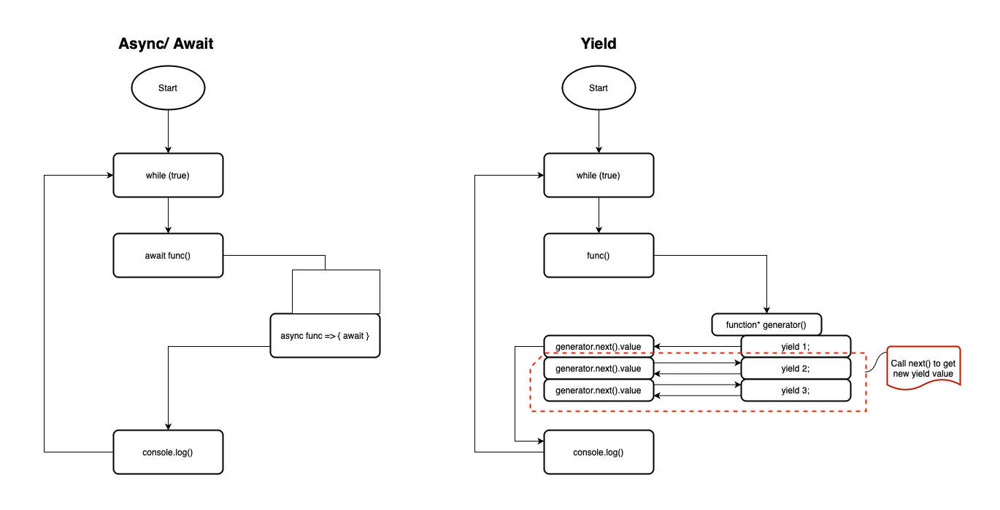

# So sánh giữa Yield và Async/Await
`yield` và `async/await` là hai cơ chế khác nhau được sử dụng trong ngôn ngữ lập trình JavaScript để quản lý đồng bộ và xử lý bất đồng bộ.

Flow:



1. **`yield` trong Generator Functions:**
   - `yield` được sử dụng trong các Generator Functions để tạo ra một giá trị từ một hàm mà sau đó có thể được tiếp tục từ nơi `yield` đó.
   - Generator Functions có thể tạm dừng và tiếp tục lại, cho phép bạn viết mã đồng bộ theo kiểu gián đoạn (iterative).
   - Ví dụ:

     ```javascript
     function* generatorFunction() {
       yield 1;
       yield 2;
       yield 3;
     }

     const generator = generatorFunction();

     console.log(generator.next()); // { value: 1, done: false }
     console.log(generator.next()); // { value: 2, done: false }
     console.log(generator.next()); // { value: 3, done: false }
     console.log(generator.next()); // { value: undefined, done: true }
     ```

2. **`async/await`:**
   - `async/await` là một cơ chế mới hơn, được sử dụng để làm cho việc xử lý bất đồng bộ trở nên dễ đọc hơn và dễ quản lý hơn.
   - `async` được sử dụng để đánh dấu một hàm là bất đồng bộ, và `await` được sử dụng để chờ đợi một Promise được giải quyết trước khi tiếp tục thực hiện hàm.
   - Ví dụ:

     ```javascript
     async function exampleAsyncFunction() {
       let result1 = await asyncFunction1();
       let result2 = await asyncFunction2(result1);
       return result2;
     }

     exampleAsyncFunction().then(result => {
       console.log(result);
     });
     ```

   - `async/await` thường được ưa chuộng hơn vì nó giúp tránh callback hell và làm cho mã trở nên rõ ràng hơn khi xử lý các tác vụ bất đồng bộ.

Tóm lại, `yield` thường được sử dụng trong ngữ cảnh của các Generator Functions để tạo ra một chuỗi các giá trị được trả về theo kiểu gián đoạn, trong khi `async/await` thường được sử dụng để quản lý và đơn giản hóa mã xử lý bất đồng bộ.